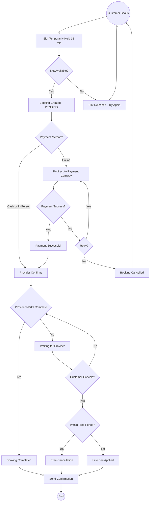

  

# Booking Core

A multi-tenant booking engine built with [NestJS](https://nestjs.com/) and PostgreSQL. Designed for businesses that offer services requiring scheduling and appointment booking.

> **Why this project exists?** See [CASE-STUDY.md](./CASE-STUDY.md) for the full problem statement and design decisions.

## What It Does

Booking Core lets multiple businesses (tenants) run on a single platform, each managing their own services, providers, schedules, and bookings. Customers can browse available services, book time slots, pay online or in person, and receive notifications at every step.

## Booking Flow

## Key Features

**Multi-Tenant** — Multiple businesses share one platform, each with isolated data, settings, and policies.

**Service & Provider Management** — Tenants can set up providers with their own schedules, breaks, and service offerings.

**Smart Slot Availability** — Available time slots are calculated from provider schedules, existing bookings, temporary holds, and break times.

**Temporary Slot Locking** — When a customer selects a slot, it is held briefly to prevent double-booking while they complete the booking.

**Payment Tracking** — Support for online payment gateways and cash payments, with webhook-based status updates.

**Cancellation Policies** — Configurable per-tenant rules for free cancellation windows and late fees.

**Real-Time Notifications** — Email, SMS, push, and WebSocket notifications triggered by booking events.

**Audit Trail** — Every booking status change is logged with who changed it and why.

## Roles

| Role | What They Do |
|------|-------------|
| **Customer** | Browse services, book slots, make payments, cancel or reschedule |
| **Provider** | Manage availability, confirm bookings, deliver services, mark complete |
| **Admin** | Manage tenant settings, providers, services, and monitor all bookings |
| **Super Admin** | Platform-level management — create tenants, manage users across tenants |

## Architecture Diagrams

For detailed architecture diagrams (system overview, auth flow, booking flow, database ER diagram, etc.), see [docs/mermaid/](docs/mermaid/).

  MIT licensed. Built with NestJS, Prisma, and PostgreSQL.

