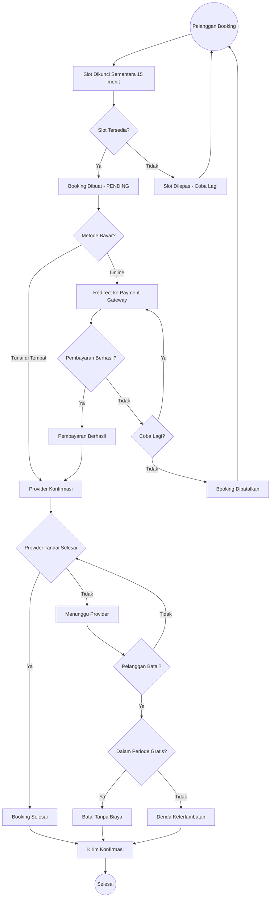

  

# Nest Booking Core

Mesin booking multi-tenant yang dibangun dengan [NestJS](https://nestjs.com/) dan PostgreSQL. Dirancang untuk bisnis yang menawarkan layanan berbasis jadwal dan reservasi.

> **Kenapa project ini ada?** Lihat [CASE-STUDY.md](./CASE-STUDY.md) untuk latar belakang masalah dan keputusan desain.

## Apa yang Dilakukan

Nest Booking Core memungkinkan banyak bisnis (tenant) berjalan di satu platform, masing-masing dengan data terisolasi: layanan, provider, jadwal, dan booking. Pelanggan bisa melihat layanan yang tersedia, memilih waktu, membayar, dan menerima notifikasi di setiap langkah.

## Alur Booking

## Fitur Utama

**Multi-Tenant** — Banyak bisnis dalam satu platform, masing-masing dengan data, pengaturan, dan kebijakan terpisah.

**Manajemen Layanan & Provider** — Tenant bisa mengatur provider dengan jadwal, jam istirahat, dan layanan yang ditawarkan.

**Ketersediaan Slot Cerdas** — Slot waktu dihitung dari jadwal provider, booking yang sudah ada, hold sementara, dan jam istirahat.

**Penguncian Slot Sementara** — Saat pelanggan memilih slot, slot dikunci sementara untuk mencegah double booking.

**Pelacakan Pembayaran** — Mendukung payment gateway online dan pembayaran tunai, dengan update status via webhook.

**Kebijakan Pembatalan** — Aturan fleksibel per tenant untuk periode bebas biaya dan denda keterlambatan.

**Notifikasi Real-Time** — Email, SMS, push, dan WebSocket notification yang terpicu oleh setiap event booking.

**Audit Trail** — Setiap perubahan status booking dicatat: siapa yang mengubah, kapan, dan alasannya.

## Peran Pengguna

| Peran | Tugas |
|-------|-------|
| **Pelanggan** | Lihat layanan, booking slot, bayar, batal atau reschedule |
| **Provider** | Atur ketersediaan, konfirmasi booking, berikan layanan, tandai selesai |
| **Admin** | Kelola pengaturan tenant, provider, layanan, dan pantau semua booking |
| **Super Admin** | Manajemen level platform — buat tenant, kelola user lintas tenant |

## Diagram Arsitektur

Untuk diagram arsitektur lengkap (system overview, alur auth, alur booking, database ER diagram, dll.), lihat [docs/mermaid/](docs/mermaid/).

  MIT licensed. Dibangun dengan NestJS, Prisma, dan PostgreSQL.

