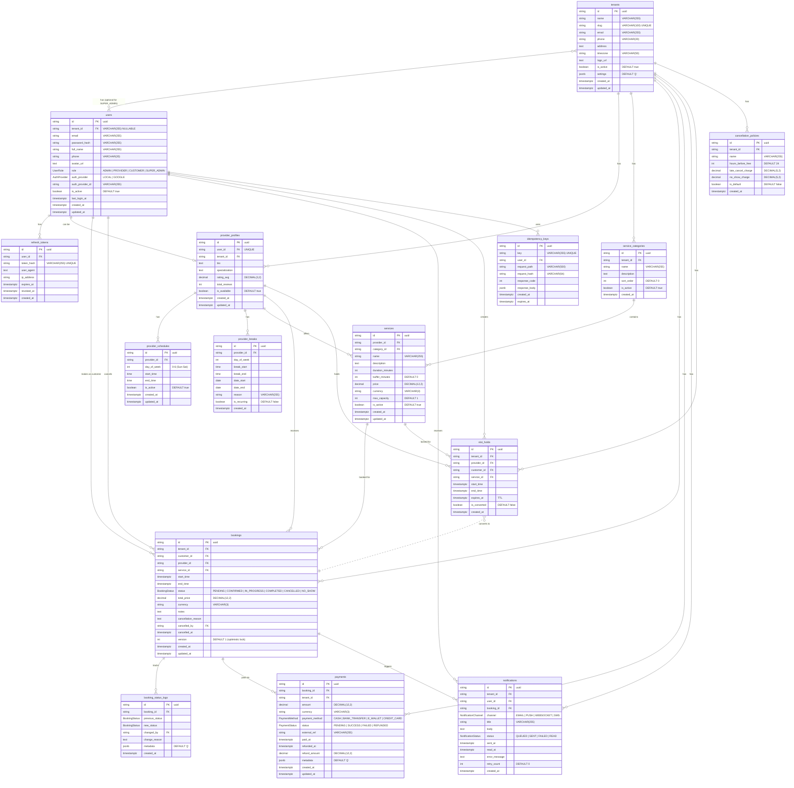

# 🗄️ NestJS Booking Core — Database Schema (ER Diagram)

## Entity Relationship Diagram



---

## 📊 Table Summary

| #   | Table                   | Purpose                                        | Priority  |
| --- | ----------------------- | ---------------------------------------------- | --------- |
| 1   | `tenants`               | Multi-tenant root organization                 | 🔴 Must   |
| 2   | `users`                 | All users (Admin, Provider, Customer)          | 🔴 Must   |
| 3   | `refresh_tokens`        | JWT refresh token storage & session management | 🔴 Must   |
| 4   | `provider_profiles`     | Provider business profiles                     | 🔴 Must   |
| 5   | `provider_schedules`    | Provider work schedules (recurring)            | 🔴 Must   |
| 6   | `provider_breaks`       | Provider breaks & time off                     | 🟡 Should |
| 7   | `service_categories`    | Service categorization                         | 🟡 Should |
| 8   | `services`              | Services offered by providers                  | 🔴 Must   |
| 9   | `bookings`              | Core booking entity with time slots            | 🔴 Must   |
| 10  | `booking_status_logs`   | Audit trail for booking changes                | 🟡 Should |
| 11  | `slot_holds`            | Temporary slot locking (TTL-based)             | 🔴 Must   |
| 12  | `payments`              | Payment tracking                               | 🟡 Should |
| 13  | `idempotency_keys`      | Anti double-processing                         | 🟢 Nice   |
| 14  | `cancellation_policies` | Configurable cancellation rules                | 🟢 Nice   |
| 15  | `notifications`         | Notification logging                           | 🟡 Should |

---

## 🔑 Key Features

### 1. Multi-Tenancy

- **Strategy**: `tenant_id` column di semua tabel utama
- **Isolation**: Row-level security ready (PostgreSQL RLS)
- **Scalability**: Support 1000+ tenants dalam 1 database

### 2. Double Booking Prevention

- **Application Level**: Slot holds dengan TTL (5 menit)
- **Database Level**: PostgreSQL EXCLUDE constraints (ready untuk ditambahkan)
- **Optimistic Locking**: `version` column di bookings

### 3. Session Management

- **JWT Access Token**: Short-lived (15-30 menit)
- **JWT Refresh Token**: Long-lived, stored in database
- **Token Revocation**: Delete refresh token on logout
- **Device Tracking**: `user_agent` & `ip_address` logged

### 4. Audit Trail

- **Booking Status Changes**: Every status change logged
- **Metadata**: JSONB for flexible context storage
- **Changed By**: Track who made the change

### 5. Real-time Slot Locking

- **Temporary Hold**: 5-minute TTL
- **Auto-expire**: `expires_at` index for cleanup jobs
- **Conversion Tracking**: `is_converted` flag

---

## 📝 Enums

### UserRole

```
ADMIN | PROVIDER | CUSTOMER | SUPER_ADMIN
```

ADMIN | PROVIDER | CUSTOMER

```

### AuthProvider

```

LOCAL | GOOGLE

```

### BookingStatus

```

PENDING → CONFIRMED → IN_PROGRESS → COMPLETED
↘ CANCELLED
↘ NO_SHOW

```

### PaymentStatus

```

PENDING → SUCCESS
→ FAILED
→ REFUNDED

```

### PaymentMethod

```

CASH | BANK_TRANSFER | E_WALLET | CREDIT_CARD

```

### NotificationChannel

```

EMAIL | PUSH | WEBSOCKET | SMS

```

### NotificationStatus

```

QUEUED → SENT → READ
→ FAILED (with retry)

```

---

## 🔗 Links

- [Prisma Schema Files](../prisma/models/)
- [Migration Files](../prisma/migrations/)
- [Database Setup Guide](../DATABASE_SETUP.md)
```
